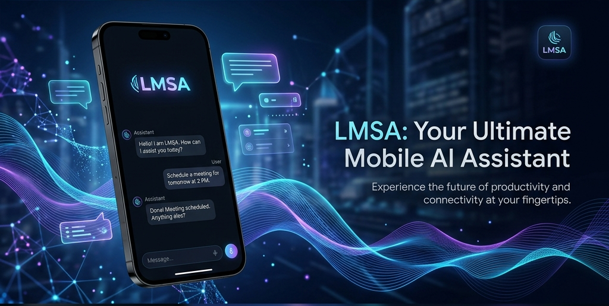

# LMSA: Local Model Smart Assistant



LMSA is a premium, feature-rich Android interface designed for seamless interaction with Large Language Models (LLMs). If you're running local models via **LM Studio** and **Ollama** or leveraging cloud power through **OpenRouter**, LMSA provides a state-of-the-art chat experience with a focus on privacy, performance, and rich feature sets.

## Key Features

- **Multiple Providers**: Built-in support for Local Servers (LM Studio, Ollama), OpenRouter, and any OpenAI-compatible API.
- **Advanced File Support**: Upload PDFs, DOCX, and code files directly into your chat for instant context and analysis.
- **Multimodal Vision**: Full support for image prompts and vision-language models.
- **Web Search Integration**: Enhance your AI's knowledge with integrated web search capabilities.
- **Character Card V2**: Import and manage complex AI personas using the industry-standard V2 specification.
- **Native Text-to-Speech**: Listen to your AI's responses with high-quality, native Android TTS integration.
- **Power Tools**: 
    - **LaTeX Support**: Beautifully rendered mathematical formulas via KaTeX.
    - **Code Highlighting**: Professional syntax highlighting for hundreds of languages.
    - **OCR**: Extract text from images using on-device Tesseract OCR.
- **Security**: Secure your chats with **Biometric Lock** and maintain privacy by keeping data local.

## Technology Stack

- **Android Native**: Built with Kotlin and modern Android Jetpack components.
- **Hybrid Core**: High-performance WebView implementation for a rich, responsive UI.
- **Modern Web UI**: Styled with a custom, premium design system inspired by Tailwind CSS.
- **Open Source Libraries**: 
    - [KaTeX](https://katex.org/) (Math rendering)
    - [Highlight.js](https://highlightjs.org/) (Syntax highlighting)
    - [Tesseract.js](https://tesseract.projectnaptha.com/) (OCR)
    - [PDF.js](https://mozilla.github.io/pdf.js/) (PDF viewing)

## Download

LMSA is available for download on the Google Play Store:

<a href="https://play.google.com/store/apps/details?id=com.lmsa.app">
  
</a>

## Demo Video

[](https://www.youtube.com/watch?v=DUs2yEvJeWg)

## Getting Started

### Prerequisites
- Android Studio Ladybug or later.
- Android SDK 34+.
- A local LLM server (optional, for local mode).

### Building from Source
1. Clone the repository:
   ```bash
   git clone https://github.com/TechMitten/LMSA.git
   ```
2. Open the project in **Android Studio**.
3. Sync Project with Gradle Files.
4. Build and run on your device or emulator.

## Import & Export
LMSA makes it easy to migrate your workflows:
- **LM Studio Profiles**: Import your system prompts and configurations directly.
- **Character Cards**: Full support for `.json` and image-embedded Character Card V2.
- **Chat History**: Export your conversations for backup or analysis.

## License
This project is licensed under the [MIT License](LICENSE).

---
Built with ❤️ by the LMSA Team.

*(Google Play and the Google Play logo are trademarks of Google LLC.)*
